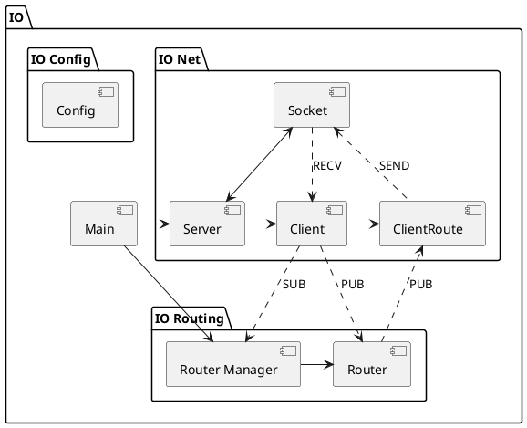
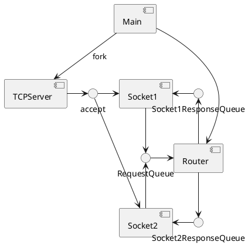
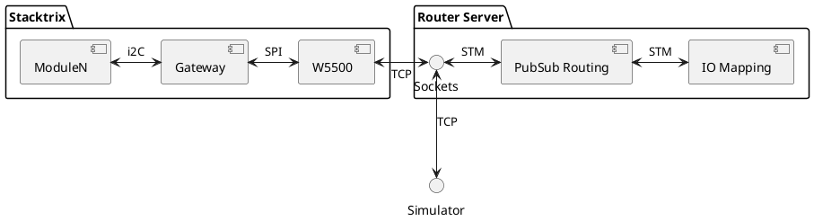

Busbroker is a custom modification of [punybroker](https://github.com/voneiden/punybroker) 
serving as the broker for a flight simulator build. 

Consider a simpler v2

* RequestQueue is derived in main, provided to sockets, handled by router
* Sockets create their own ResponseQueue and provide it to the router when subscribing

